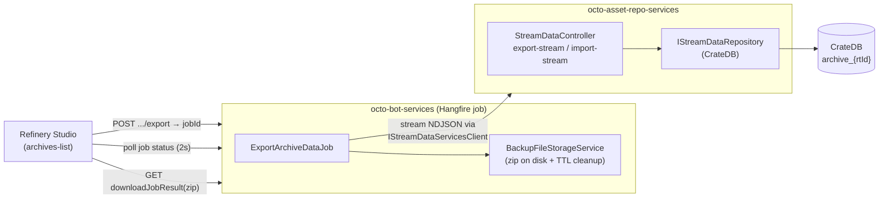
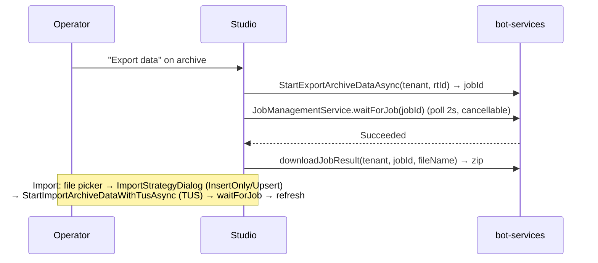

# Concept: Archive Data Export / Import in Studio UI

> Work item: **AB#4230** (parent epic **AB#3364** "Stream data version 2").
> Successor: **AB#4231** — tenant backup/restore reuses this export/import mechanism.
> Status: **Refinement / design**. Decisions captured in §2 were taken during refinement on 2026-06-25.

## §1 Goal & Scope

Allow an operator to **export the data rows of an archive** and **import them back** from
within the Refinery Studio.

In scope:

- Export the CrateDB row data of a selected archive (raw, time-range, **and** rollup) to a
  downloadable file. The operator chooses **either the whole archive or a time window**
  `[from, to)` (decision #5, §2).
- Import row data into a selected archive.
- Import is **rejected with a clear error** unless the source matches the target on:
  - same `rtCkTypeId` (`ArchiveSnapshot.TargetCkTypeId`), and
  - same configured columns (`ArchiveSnapshot.Columns` — `Path` / `Indexed` / `Required`).
- Progress feedback, large-dataset streaming, cancellation.

Out of scope (tracked separately):

- Integration into tenant backup/restore (**AB#4231**) — this concept only provides the
  reusable building block.
- Migrating the archive **definition** export. That already exists in the Studio
  (`exportRtModelDeepGraph` / `importRtModel`) and exports the *entity*, **not** the row data.
  This feature is strictly about the **data rows** and is a separate menu action.

### §1.1 Why this is not the existing "Export" button

The archives list (`archives-list.component.ts`) already has Export/Import actions, but they
call `AssetRepoService.exportRtModelDeepGraph` / `importRtModel` — i.e. the **runtime-model**
deep-graph of the `CkArchive` *definition*. They do **not** touch the CrateDB tables. AB#4230
adds a **second, clearly-labelled pair of actions** ("Export data" / "Import data") that move
the actual time-series rows.

## §2 Decisions taken at refinement (2026-06-25)

| # | Open point (from the issue) | Decision |
|---|------------------------------|----------|
| 1 | Export format | **ZIP container**: `metadata.json` (schema + provenance) + `data.ndjson` (one row per line, streamable). Self-describing so import can validate the schema match. |
| 2 | Execution model & host service | **Async Hangfire job in `octo-bot-services`** (same infra as tenant dump/restore: Hangfire + TUS + `BackupFileStorageService`). Frontend reuses `JobManagementService.waitForJob` + `downloadJobResult`. CrateDB I/O is delegated to `octo-asset-repo-services` via the SDK (see §5). |
| 3 | Import target archive kinds | **All three** (raw, time-range, rollup). Rollup import needs extra guards (§7). |
| 4 | Permission | Existing **`StreamDataAdmin`** role for both export and import (optionally split export→`StreamDataReader` later — roles already exist in `CommonConstants`). |
| 5 | Export selection (v1) | **Whole archive *or* a time window `[from, to)`.** The operator picks at export time; the window is carried in `metadata.json` and applied as a predicate on the keyset scan. |

### §2.1 Architectural consequence of decision #2

`octo-bot-services` performs the existing tenant dump via `ISystemContext` + `mongodump`. It does
**not** reference the CrateDB stream engine (`Runtime.Engine.CrateDb`) and has no
`IStreamDataRepository` wiring. To keep CrateDB access in exactly one place
(`octo-asset-repo-services`, where `IStreamDataRepository` already lives), the bot job acts as an
**orchestrator** and delegates the row I/O over HTTP via the existing SDK client
`IStreamDataServicesClient`:



The same split is exactly what AB#4231 will reuse: a tenant-backup job in bot-services can bundle
the Mongo dump **and** one archive-data ZIP per archive into a single backup artifact.

> **Alternative considered (rejected for now):** reference `Runtime.Engine.CrateDb` directly in
> bot-services and read CrateDB inside the job (mirrors how `mongodump` is self-contained). Cleaner
> data path but pushes CrateDB connection config + DI wiring into a second service and duplicates
> the engine surface. Revisit only if the HTTP hop becomes a throughput bottleneck.

## §3 File Format

A single ZIP per archive:

```
export-<archiveWellKnownName-or-rtId>-<yyyyMMdd-HHmmss>.zip
├── metadata.json     # schema + provenance, read first on import
└── data.ndjson       # one JSON object per line — one archive row per line
```

### §3.1 `metadata.json`

```jsonc
{
  "formatVersion": 1,
  "exportedAtUtc": "2026-06-25T10:32:11Z",
  "sourceTenantId": "acme",
  "archive": {
    "rtId": "665f...e21",
    "rtWellKnownName": "voltage-raw",
    "kind": "raw",                       // raw | timeRange | rollup
    "targetCkTypeId": "Sensor",          // == rtCkTypeId — import match key #1
    "columns": [                         // == configured columns — import match key #2
      { "path": "voltage", "indexed": true,  "required": false },
      { "path": "current", "indexed": false, "required": false }
    ],
    "rollupAggregations": null,          // populated only when kind == rollup
    "period": null                       // populated only when kind == timeRange
  },
  "window": {                            // null ⇒ whole archive; otherwise the exported slice
    "fromUtc": "2026-06-01T00:00:00Z",   // inclusive
    "toUtc":   "2026-07-01T00:00:00Z"    // exclusive
  },
  "rowCount": 184223                      // advisory; for progress + post-import sanity check
}
```

`columns`, `targetCkTypeId`, `kind`, `rollupAggregations`, `period` are projected straight from
`ArchiveSnapshot` / `CkArchiveColumnSpec` / `CkRollupAggregationSpec` (see
`Runtime.Contracts/StreamData/ArchiveSnapshot.cs`).

### §3.2 `data.ndjson`

One row per line. Columns mirror the CrateDB physical layout produced by `ArchiveDdlGenerator`:

- **raw**: `rtid`, `timestamp`, `ckTypeId`, `rtWellKnownName`, `rtCreationDateTime`,
  `rtChangedDateTime`, plus one key per user column path.
- **time-range / rollup (windowed)**: `window_start`, `window_end`, `was_updated`, `rtid`,
  `ckTypeId`, … plus user/derived columns.

```jsonc
{"rtid":"61a...","timestamp":"2026-06-01T00:00:00Z","ckTypeId":"Sensor","voltage":230.1,"current":5.2}
{"rtid":"61a...","timestamp":"2026-06-01T00:00:10Z","ckTypeId":"Sensor","voltage":229.8,"current":5.1}
```

NDJSON is chosen so both export (writer) and import (reader) stream line-by-line and never
materialise the whole dataset in memory. The ZIP wrapper keeps `metadata.json` next to the data
and gives transparent compression for the highly repetitive time-series rows.

## §4 Backend — `octo-asset-repo-services` (CrateDB I/O)

The row I/O lives where `IStreamDataRepository` is already registered.

### §4.1 New streaming repository methods

`IStreamDataRepository` (`Runtime.Contracts/StreamData/IStreamDataRepository.cs`) gains a
**streaming export** that does not buffer the full result set — today's `ExecuteQueryAsync`
materialises a `StreamDataQueryResult`, which is unacceptable for multi-GB archives:

```csharp
/// Streams the rows of the archive in a stable key order (keyset pagination on the natural
/// key) so the caller can serialise NDJSON without buffering the table. When <paramref
/// name="window"/> is non-null only rows whose timestamp / window_start fall in [from, to)
/// are emitted — the predicate rides on the already time-ordered keyset scan, so a windowed
/// export is no more expensive than a full one (and cheaper).
IAsyncEnumerable<IReadOnlyDictionary<string, object?>> ExportRowsAsync(
    OctoObjectId archiveRtId, TimeWindow? window, CancellationToken ct);

/// Bulk-inserts pre-parsed rows (reuses the existing batch-insert + ON CONFLICT upsert paths).
Task ImportRowsAsync(
    OctoObjectId archiveRtId,
    IAsyncEnumerable<IReadOnlyDictionary<string, object?>> rows,
    ImportMode mode,                       // InsertOnly | Upsert
    CancellationToken ct);
```

Implemented in `Runtime.Engine.CrateDb/CrateDbStreamDataRepository.cs` using keyset pagination
(`WHERE (timestamp, rtid) > (?, ?) ORDER BY timestamp, rtid LIMIT N`) for export, and the existing
batched `InsertAsync` / `InsertTimeRangeAsync` paths for import.

### §4.2 New REST endpoints on `StreamDataController`

Internal (service-to-service) streaming endpoints, parallel to the existing archive lifecycle
routes. Bearer auth, `StreamDataAdmin` policy (export optionally `StreamDataReader`):

| Method | Route | Body / Response |
|--------|-------|-----------------|
| GET | `archives/{archiveRtId}/export-stream?fromUtc=&toUtc=` | Streams `application/x-ndjson` (chunked); no buffering. `fromUtc`/`toUtc` optional — both omitted ⇒ whole archive; present ⇒ window `[from, to)`. Predicate on `timestamp` (raw) or `window_start` (windowed). |
| POST | `archives/{archiveRtId}/import-stream?mode=Upsert` | Consumes `application/x-ndjson`; validates schema first (§6), streams inserts. |
| GET | `archives/{archiveRtId}/schema` | Returns the `metadata.archive` block for pre-flight match (or reuse `getSystemStreamDataArchiveColumnsById`). |

These are consumed by the bot job, **not** by the browser directly (the browser talks only to
bot-services for a single download/upload artifact + job polling).

## §5 Backend — `octo-bot-services` (orchestration)

Mirrors `DumpRepositoryJob` / `RestoreRepositoryJob`.

### §5.1 Jobs

```csharp
public interface IExportArchiveDataJob
{
    // Returns the produced zip file path (registered with BackupFileStorageService).
    // window == null ⇒ whole archive; otherwise the [from, to) slice (decision #5).
    Task<string?> Run(string tenantId, string archiveRtId, TimeWindow? window,
                      IBotCancellationToken? ct);
}

public interface IImportArchiveDataJob
{
    Task Run(string tenantId, string archiveRtId, string uploadedFilePath,
             ImportMode mode, IBotCancellationToken? ct);
}
```

- **Export job**: open zip stream → write `metadata.json` (fetched via `archives/{id}/schema`)
  → open `data.ndjson` entry → pump `GET export-stream` line-by-line into it → store the zip via
  `BackupFileStorageService` (`{tenantId}/<name>-<ts>-<guid>.zip`) → register as a downloadable
  job result. Honours `IBotCancellationToken`.
- **Import job**: read uploaded zip → parse `metadata.json` → **schema-match validation (§6)** →
  if OK, stream `data.ndjson` to `POST import-stream` → clean up the uploaded file.

### §5.2 SDK additions

- `IStreamDataServicesClient` (asset-repo client): `ExportRowsStreamAsync(tenantId, archiveRtId,
  TimeWindow? window)` → `Stream`; `ImportRowsStreamAsync(tenantId, archiveRtId, Stream ndjson,
  ImportMode)`; `GetArchiveSchemaAsync(tenantId, archiveRtId)`.
- `IBotServicesClient`: `StartExportArchiveDataAsync(tenantId, archiveRtId, TimeWindow? window)` →
  `JobResponseDto`;
  `StartImportArchiveDataWithTusAsync(tenantId, archiveRtId, filePath, mode)` (TUS resumable
  upload, same as restore); download via existing `DownloadJobResultBinary`.
- New bot REST routes: `POST jobs/export-archive-data`, `POST jobs/import-archive-data-from-upload`.

## §6 Schema-match validation (the hard requirement)

Performed by the **import job** before any write, comparing `metadata.json` against the live
target archive schema (`archives/{id}/schema`):

1. `metadata.archive.targetCkTypeId` **==** target `ArchiveSnapshot.TargetCkTypeId`.
2. Column sets equal as a **set** keyed by `Path`, each with matching `Indexed` + `Required`
   (order-independent; reuse the canonicalisation already used elsewhere in the engine).
3. `kind` matches (raw↔raw, timeRange↔timeRange, rollup↔rollup) — windowed vs point storage
   layout must agree.
4. For rollup: `rollupAggregations` specs equal (same column derivation).

On any mismatch the job fails with a **specific, field-level** message (per the
`feedback_rtid_must_be_hex` precedent of surfacing per-field detail, not a generic
"invalid model"), e.g.:

> Import rejected: target archive `voltage-raw` expects column `current` (required=false) but the
> export was taken from an archive without it. Schemas must match exactly.

The Studio surfaces this verbatim via `MessageService.showErrorWithDetails()` (already used by
`JobManagementService` on job failure).

## §7 Import into rollup / windowed archives (decision #3 = all three kinds)

Rollup archives are normally **derived** from a source by the orchestrator via a watermark. A naïve
import would be silently overwritten on the next aggregation pass. Guards:

1. **Precondition: target archive must be `Disabled`** during import (uniform across all kinds —
   no live inserts/queries; the CrateDB table is preserved while disabled). The Studio prompts the
   operator to disable → import → re-enable, or offers a "disable, import, re-enable" wrapped flow.
2. **For rollups specifically**, additionally **freeze** the imported `[min(window_start),
   max(window_end))` range via the existing `freezeRollupArchive(until)` (monotonic) so the
   orchestrator will not re-aggregate over the imported buckets after re-enable. `was_updated` is
   preserved from the export.
3. Import uses `mode=Upsert` for windowed archives (natural-key `ON CONFLICT`, same path as
   `InsertTimeRangeAsync`) and `InsertOnly` (default) for raw.

This keeps "all three kinds" working without corrupting the orchestrator's invariants.

## §8 Frontend — Refinery Studio

`octo-frontend-refinery-studio/.../tenants/repository/archives/archives-list.component.ts`.

### §8.1 New actions (distinct from existing model export)

- **Row action / context menu**: `Export data` (visible when archive is `Activated`/`Disabled` and
  `tableExists`). Opens a small **export dialog**: a toggle "Whole archive / Time window" and, when
  *Time window* is chosen, a Kendo date-range picker (from/to, UTC). The picked window is passed to
  `StartExportArchiveDataAsync`; "whole archive" sends no bounds.
- **Row action**: `Import data` (visible when archive exists; opens hidden `<input type=file
  accept=".zip">`, like the existing import).
- Label the **existing** entries `Export definition` / `Import definition` to remove ambiguity.

### §8.2 Flow (reuses existing job plumbing verbatim)



- Progress: `ProgressWindowService.showIndeterminateProgress` (spinner) — row counts allow a later
  switch to determinate (`rowCount` in metadata).
- Cancellation: existing cancel button on the progress dialog → `IBotCancellationToken`.
- Large data: TUS resumable upload for import (≤5 GiB cap already configured); chunked stream for
  export. No browser-side buffering of the dataset (download is a single GET to bot-services).

### §8.3 Reused services (no new infra)

`JobManagementService` (`waitForJob`, `downloadJobResult`), `ProgressWindowService`,
`ImportStrategyDialogService`, `ConfirmationService` (+ `tenantModeService.confirmProductionAction`
for the destructive import), `ListViewComponent` `CommandItem` toolbar/context-menu pattern.

## §9 Permissions

`StreamDataAdmin` for both `export-stream` and `import-stream` (and the bot routes). Roles already
exist in `Communication.Contracts/CommonConstants.cs` (`StreamDataAdminRole`,
`StreamDataWriterRole`, `StreamDataReaderRole`). Optional future split: export →
`StreamDataReader`, import → `StreamDataAdmin`. No Identity seeding change for the default choice.

## §10 Edge cases & validation rules

- **Empty archive / no table**: export of a `Created` archive (no CrateDB table) → 0-row NDJSON +
  valid metadata, not an error.
- **Disabled archive export**: allowed (table preserved).
- **Concurrent writes during export**: export is a consistent keyset scan; live inserts after the
  scan cursor are simply not included (documented, not an error).
- **rtId hex guard**: imported `rtid` values validated as 24-char hex (`feedback_rtid_must_be_hex`).
- **Column path with arrays/records**: NDJSON carries the CrateDB physical column value as-is;
  array/record handling follows `ArchivePathTypeResolver`.
- **Format/version skew**: `formatVersion` gate; unknown future version → explicit reject.
- **Cross-tenant import**: allowed as long as schema matches (`sourceTenantId` is provenance only).

## §11 Implementation phases

1. **Repo layer**: `ExportRowsAsync` (keyset + optional `[from, to)` predicate) + `ImportRowsAsync`
   on `IStreamDataRepository` / `CrateDbStreamDataRepository`, plus the `TimeWindow` record +
   unit/integration tests against the Crate fixture (whole-archive **and** windowed cases).
2. **asset-repo REST**: `export-stream` / `import-stream` / `schema` endpoints + `StreamDataAdmin`
   policy.
3. **SDK**: `IStreamDataServicesClient` stream methods; `IBotServicesClient` start/upload methods +
   DTOs.
4. **bot-services jobs**: `ExportArchiveDataJob` / `ImportArchiveDataJob` (zip writer/reader,
   metadata, schema validation §6, rollup guards §7), Hangfire registration, bot REST routes,
   `BackupFileStorageService` reuse + retention.
5. **Studio**: `Export data` / `Import data` actions, rename existing to `… definition`, wire job
   polling + TUS upload + strategy dialog.
6. **Docs/CLI/MCP (optional, follow-up)**: `octo-cli` + MCP `export_archive_data` /
   `import_archive_data` tools mirroring the bot routes (consistent with existing archive tools).

## §12 Open questions for further refinement

- **Determinate progress**: emit processed-row count from the job for a percentage bar (needs
  `rowCount` up front — already in metadata)?
- **Compression level / split**: single zip vs multi-part for very large archives (>5 GiB TUS cap)?
- **Rollup import UX**: auto "disable → import → freeze → re-enable" wrapper vs requiring the
  operator to do it explicitly?
