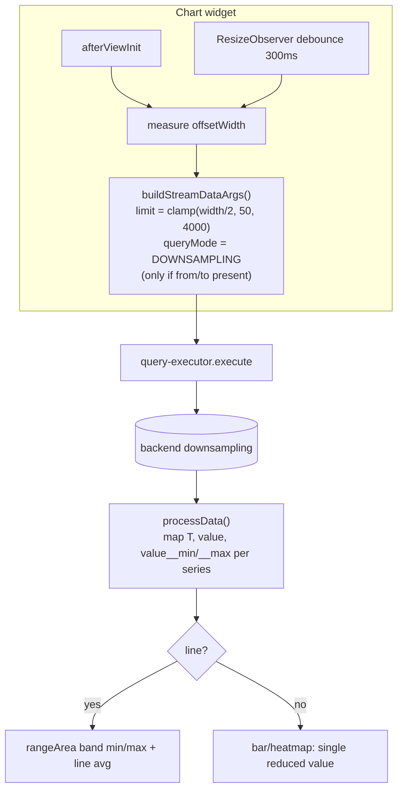

# Concept: Downsampling for Simple (non-aggregating) Stream-Data Queries

**Work item:** AB#4233 (Stream data v2 / epic AB#3364) — covers both backend and frontend.
**Related:** AB#3621 (persistent SD queries + query types), AB#4187 (MeshBoard widgets consuming SD queries), [`concept-time-range-archives.md`](concept-time-range-archives.md) §7 (windowed-storage containment).

## 1. Goal

Charts must not pull every raw row into the browser. A line chart that is ~1000 px wide cannot show more than ~1000–2000 distinct points, yet today a `SimpleSdQuery` over a year of 15-minute meter readings returns the full set (e.g. 33 224 rows / 16 612 timestamps for the voest board). The browser must be able to ask the backend for a **representative N-point reduction sized to the chart's pixel width**, where N is driven by the rendered width.

This requires:
- **Backend:** make `queryMode: DOWNSAMPLING` reduce a `SimpleSdQuery` (raw, non-aggregating) to exactly `limit` buckets — today the CrateDB compiler only downsamples when the query carries aggregations.
- **Frontend:** chart widgets compute `limit` from their pixel width and request downsampling automatically.

## 2. Current state (verified)

### 2.1 The execution variant is chosen by type, not by `queryMode`

`queryMode` on `StreamDataArguments` is currently a **no-op placeholder** that exists only because the schema declares it non-null.

| Scope | Decision point | File |
|---|---|---|
| Persistent | `switch` over the loaded entity's CK subtype (`RtSimpleSdQuery` → `Variant.Simple`, …) | `octo-asset-repo-services` `GraphQL/Types/StreamDataQueryDtoType.cs:107–327` |
| Transient | Which GraphQL sub-connection is called (`.simple`/`.downsampling`/…) | `octo-asset-repo-services` `GraphQL/StreamDataTransientQuery.cs:36–98` |
| Repo dispatch | `StreamQueryExecutionInput.Variant` switch | `GraphQL/StreamDataVariantExecutor.cs:56–109` |
| SQL compile | `CrateQueryBuilder.QueryMode`, set **internally** by `WithDownsampling()` | `Runtime.Engine.CrateDb/QueryBuilder/CrateQueryBuilder.cs:349–356` |

`StreamDataArguments.QueryMode` (`GraphQL/Types/Inputs/StreamDataArgumentsGraphType.cs:80`, default `Default`) is **never read**. Consequence: even if a client sends `queryMode: DOWNSAMPLING` on a `RtSimpleSdQuery`, the backend still runs the Simple variant and returns raw rows.

### 2.2 The aggregating downsampling machine already exists

`Runtime.Engine.CrateDb/QueryBuilder/CrateQueryCompiler.cs`:
- `:18–22` — dispatch: `if (QueryMode == Downsampling && HasAggregations) return CompileDownsamplingQuery(...)`.
- `:86–202` — `CompileDownsamplingQuery`: `SELECT bins.ts AS "T"` (`:115`), `FROM generate_series(from, to, interval) AS bins(ts)` (`:139`, yields exactly `Limit` bins), `LEFT JOIN <table> AS d ON DATE_BIN(interval, d."<time>", from) = bins.ts` (`:143`), `COUNT(d."<time>") AS "__binCount"` empty-bin sentinel (`:136`), windowed full-containment predicate (`:149–153`), `GROUP BY bins.ts ORDER BY bins.ts ASC` (`:199`).
- `:31–41` — the **simple (non-agg) fall-through**: a bare `DATE_BIN(...) AS "T"` projection that re-stamps timestamps **but does not reduce row count**. This is the gap.

Required-args validation (`From`/`To`/`Limit` all mandatory) lives in `CrateDbStreamDataRepository.ExecuteDownsamplingQueryAsync` `:602–610`. Empty bins are forced to `NULL` post-execution via the `__binCount == 0` check `:684–707`.

### 2.3 Column value types are known at compile time

`ArchivePathTypeResolver.cs:24–42` resolves each archive column path to a `CrateColumnType`; `CrateColumnType.cs:85–100` maps CK `AttributeValueTypesDto` → SQL primitive (`Boolean`, `Integer`, `Double`, `String`/`TEXT`, `DateTime`/`TIMESTAMP`). The `ArchiveSnapshot` carried into `ExecuteDownsamplingQueryAsync` exposes `Columns[]` — enough to pick a per-column default reducer.

### 2.4 Frontend already plumbs `limit` + `queryMode`

`octo-frontend-libraries` `octo-meshboard`:
- `StreamDataExecutionArgs` (`services/query-executor.service.ts:30–47`) already declares `limit`, `interval`, `queryMode`, `rtIds`; `buildStreamDataArg()` (`:243–263`) already forwards them into the GraphQL `arg`.
- Generated DTO `StreamDataArgumentsDto` + `QueryModeDto` (`DEFAULT`/`DOWNSAMPLING`/`INTERPOLATION`) already support it.
- Chart widgets' `buildStreamDataArgs()` currently emit only `from/to/rtIds`, no `limit`/`queryMode` (line `:378–386`, bar `:363–371`, heatmap `:364–372`).
- No widget measures its pixel width; only `process-widget` uses a `ResizeObserver`.
- The table widget (`table-widget-data-source.directive.ts:235–239`) paginates via `first`/`after` and must **not** be downsampled.

## 3. Decisions

| # | Decision | Choice |
|---|---|---|
| D1 | How `DOWNSAMPLING` reaches a `SimpleSdQuery` | `queryMode` on `StreamDataArguments` **overrides** the variant for `RtSimpleSdQuery` (and the transient `.simple` connection). Persisted CK type stays `SimpleSdQuery`. |
| D2 | Reduce non-aggregating columns | Synthesize a default reducer per column **value type** and feed the existing aggregating path. |
| D3 | Peak preservation | Numeric columns reduce to **MIN + MAX (+ AVG)** → line chart renders a min/max envelope band. (Extends AB#4233's AVG-only scope; chosen requirement.) |
| D4 | Multi-series separation | **Group by source `rtId` in addition to `bins.ts`** → `limit` bins **per series**. The frontend keeps grouping by its `seriesGroupField` (e.g. `obisCode`). |
| D5 | Scope of widgets | Auto-downsampling for **all SD time-series charts**: line, bar, heatmap. Table excluded (paginates). KPI/Gauge excluded (single value). |
| D6 | Default behavior | **Auto-on** for those charts when a time range is resolvable. |
| D7 | Resize | **Debounced (300 ms) re-query** with a new `limit` on width change. |
| D8 | No time range (`from`/`to` missing) | **Raw fallback** (current behavior). Downsampling requires `from`/`to`/`limit`; without a time filter we do not downsample. |
| D9 | `limit` sizing | `limit = clamp(round(widthPx / pxPerBin), 50, 4000)`, `pxPerBin ≈ 2`. |
| D10 | Reducer SQL by type | numeric → `MIN`,`MAX`,`AVG`; string/enum/bool → **LAST** via `max_by(col, <time>)`; timestamp → the synthesized bin `"T"`. |
| D11 | Empty bins | Unchanged: `__binCount = 0` → `NULL` per column; frontend already renders gaps. |
| D12 | Windowed storage | Unchanged Phase-7 full-containment (straddling windows drop, not pro-rate). |

## 4. Backend design

### 4.1 `queryMode` overrides the variant (D1)

In `StreamDataQueryDtoType` (`ResolveRowsAsync`, `:107–327`) and `StreamDataTransientQuery` (`:36–98`):

```
if (loaded is RtSimpleSdQuery simple
    && execOverride?.QueryMode == QueryModeDto.Downsampling)
{
    input.Variant = StreamQueryVariant.Downsampling;
    input.SimpleColumns = simple.Columns;          // plain columns, NOT aggregation columns
    input.IsSimpleDownsampling = true;             // marks the synthesize-reducers path
}
```

`StreamDataVariantExecutor` keeps dispatching on `Variant`; the `Downsampling` arm gains a branch: if `IsSimpleDownsampling`, build `StreamDataDownsamplingQueryOptions` from the **simple** columns instead of expecting aggregation columns.

### 4.2 Synthesize per-type reducers + group by `rtId` (D2/D3/D4/D10)

In `CrateDbStreamDataRepository.ExecuteDownsamplingQueryAsync` (or a sibling `ExecuteSimpleDownsamplingQueryAsync`): for each simple column, look up its `CrateColumnType` from the snapshot and add aggregation variable(s):

| Value type | Reducer variable(s) | Resulting cell(s) |
|---|---|---|
| Integer / Double | `AVG`, `MIN`, `MAX` | `<col>`, `<col>__min`, `<col>__max` |
| String / Enum / Boolean | `max_by(<col>, "<time>")` (LAST) | `<col>` |
| DateTime | — (use bin `"T"`) | `T` |

Plus group key: add the source identity column (`rtId`) to the `GROUP BY` (D4). The compiler's `GROUP BY bins.ts` becomes `GROUP BY bins.ts, d."rtId"`, ordered `bins.ts, rtId`. `HasAggregations` is now true, so the existing `CompileDownsamplingQuery` path runs unchanged otherwise (sentinel, containment, `generate_series`).

> Note on `generate_series` × per-series: with a `rtId` group key the LEFT JOIN must still yield one row per (bin, series). Either cross-join `generate_series` with the distinct series set, or accept that empty (bin, series) cells simply don't appear and let the frontend gap-fill. Decide in implementation; the cross-join keeps `__binCount=0` semantics per series and is preferred.

### 4.3 Row shape

A downsampled simple row carries: `T` (bin timestamp), the source `rtId`, each reduced column (`amount.value`, `amount.value__min`, `amount.value__max`, `obisCode` via LAST, …), and `__binCount`. The persisted `queryCkTypeId` stays `SimpleSdQuery`.

## 5. Frontend design



- **Width → limit:** inject `ElementRef`; read `offsetWidth` of the chart container in `afterViewInit` and on resize. Guard against 0 width (defer a tick).
- **`buildStreamDataArgs()`** (line/bar/heatmap): when `timeArgs` (from/to) is present, append `limit` (D9) and `queryMode: DownsamplingDto`; otherwise leave them off (D8 raw fallback).
- **Resize:** a debounced `ResizeObserver` (300 ms) re-runs `loadData()` only when the bucket count would change materially (e.g. width delta crosses a threshold) to avoid query storms.
- **Envelope rendering (line chart only):** extend `processData` to also pick up `<valueField>__min` / `<valueField>__max` per series and render a Kendo `rangeArea` band behind the line (avg). Bar/heatmap consume the single reduced value as today.
- **Counter badge:** the existing `rows · pts` badge now visibly confirms reduction (e.g. `1100 rows · 1100 pts` instead of `33224 rows · 16612 pts`).
- **Table widget:** unchanged (paginates).

## 6. Testing

- **Backend** (`StreamData.UnitTests/CrateQueryBuilderTests.cs`, mirror `:246–332`): simple downsampling emits `generate_series` + per-type reducers; numeric MIN/MAX/AVG present; LAST via `max_by` for string/enum/bool; `GROUP BY bins.ts, "rtId"`; full / partial / empty range; windowed-storage containment; back-compat: `SimpleSdQuery` + `queryMode: DEFAULT` still returns raw rows up to `Limit`.
- **Frontend** (octo-meshboard specs): `limit` computation from width incl. clamping; `queryMode` only when from/to present; envelope column mapping (`__min`/`__max`); debounced resize fires one reload; table widget untouched.

## 7. Phasing (all under AB#4233)

1. **BE-1** — `queryMode` overrides variant for `RtSimpleSdQuery` + transient `.simple` (D1).
2. **BE-2** — simple-downsampling compile path: per-type reducers + `rtId` grouping + min/max envelope (D2–D4, D10).
3. **FE-1** — width→limit + `queryMode` in line/bar/heatmap `buildStreamDataArgs()`, raw fallback (D5/D6/D8/D9).
4. **FE-2** — debounced resize re-query (D7).
5. **FE-3** — line-chart min/max envelope rendering (D3).
6. **Docs** — `QueryModeDto.cs` XML doc; this concept; remove the "queryMode is ignored" caveat in `query-executor.service.ts` once D1 lands.

## 8. Out of scope

- Per-column reducer overrides on `SimpleSdQuery` (later follow-up).
- LTTB / M4 perceptual decimation (bucket reduce + min/max envelope is sufficient).
- `Interpolation` query mode (still unimplemented).
- KPI / Gauge / Pie / Table downsampling.

## 9. Risks

- **`generate_series` × multi-series cross-join** cost on wide ranges — bound by `limit × seriesCount`; `limit` is clamped (D9).
- **Envelope plumbing** touches `processData` + chart template + widget config (column-name convention `__min`/`__max`); needs a clean contract so non-envelope charts ignore the extra columns.
- **Back-compat:** `queryMode: DEFAULT` MUST keep returning raw rows — covered by an explicit test.
- **Resize storms:** debounce + change-threshold guard required.
