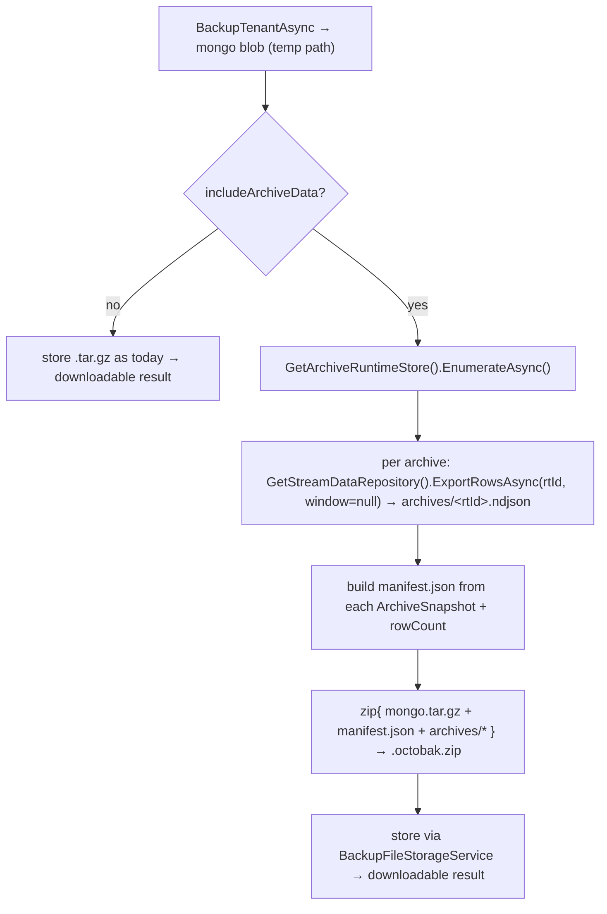
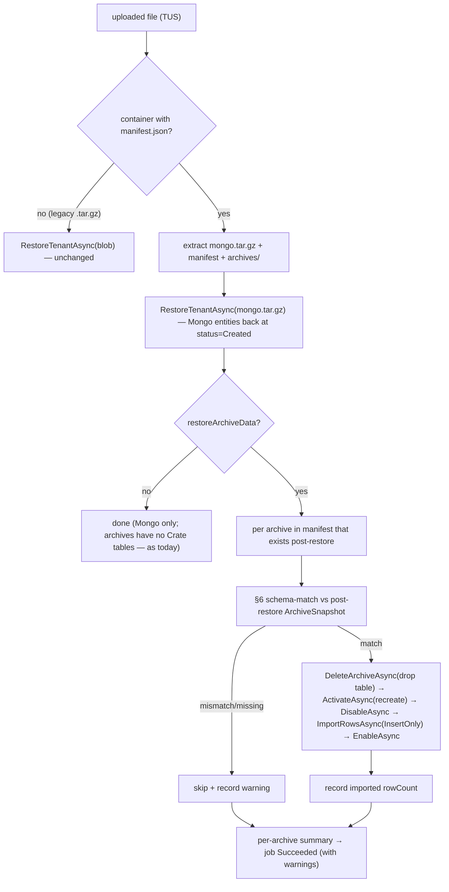

# Concept: Tenant Backup/Restore — optional archive data

> Work item: **AB#4231** (parent epic **AB#3364** "Stream data version 2").
> Predecessor: **AB#4230** (archive data export/import) — this feature **reuses** its mechanism
> (`IStreamDataRepository.ExportRowsAsync` / `ImportRowsAsync`, the NDJSON format, the §6 schema
> match). Read `concept-archive-data-export-import.md` first.
> Status: **Refinement / design**. Decisions in §2 were taken at refinement on 2026-06-25.

## §1 Goal & Scope

Extend the existing tenant backup/restore (MongoDB `mongodump`/`mongorestore`) with an **optional**
flag to also back up and restore the **CrateDB archive row data** of the tenant's archives.

In scope:

- Tenant **backup** gains an option to also back up the data of **all** archives of the tenant.
- Tenant **restore** gains the matching option to also restore archive data.
- The option is **disabled by default** — default backup/restore behaviour (Mongo metadata/config
  only) is unchanged, and existing `.tar.gz` backups keep restoring exactly as today.
- On restore, the **same schema constraints** as AB#4230 apply (matching `rtCkTypeId` + configured
  columns); see §6.

Out of scope:

- Per-archive selection / time-window filtering inside a tenant backup — backup includes **all**
  archives, whole-archive (the standalone AB#4230 export already does selective/windowed export).
- Changing the Mongo dump/restore mechanism itself.

## §2 Decisions taken at refinement (2026-06-25)

| # | Topic | Decision |
|---|-------|----------|
| 1 | Artifact format | **Default unchanged** (single `mongodump --archive --gzip` `.tar.gz`). **With** archive data → an outer **ZIP container** (`.octobak.zip`) wrapping the mongodump blob + `archives/<rtId>.ndjson` + `manifest.json`. Restore **auto-detects** the format. |
| 2 | Surfaces | Expose on **Studio + CLI + MCP** (parity with dump/restore). |
| 3 | Restore semantics (CrateDB) | **Clean / faithful**: per archive, **drop + recreate** the CrateDB table, then import — mirrors Mongo's `Drop=true`, restores the exact backup state (no stale rows). |
| 4 | Partial failure | **Continue + report**: restore every archive that matches; **skip + warn** on schema mismatch / missing archive; return a per-archive summary. The Mongo restore already succeeded, so one drifted archive must not abort the whole job. |
| 5 | Permission | Reuse the existing tenant backup/restore permission; including archive data additionally requires the archive operations already gated by **`StreamDataAdmin`** (the bot job runs in system context, same as the Mongo path). No new role. |

### §2.1 Why an outer container (not a folder inside the dump)

`ITenantBackupService.BackupTenantAsync` runs `mongodump --archive --gzip`, which emits **one
opaque binary blob** — not a tar of files we can add a folder to. So bundling archive data needs an
**outer container**. We use a ZIP (matches the AB#4230 export ZIP and the TUS-upload restore path).
The Mongo blob is stored verbatim inside it, so the existing `mongorestore` path is untouched — the
restore job just extracts `mongo.tar.gz` back out and feeds it to `RestoreTenantAsync` exactly as
today.

## §3 Backup artifact format

```
# default (includeArchiveData = false) — UNCHANGED, fully backward compatible
{tenantId}-{yyyyMMdd-HHmmss}-{guid}.tar.gz        # mongodump --archive --gzip blob

# with archive data (includeArchiveData = true)
{tenantId}-{yyyyMMdd-HHmmss}-{guid}.octobak.zip
├── mongo.tar.gz            # the mongodump blob, verbatim
├── manifest.json          # backup manifest (below)
└── archives/
    ├── <rtId>.ndjson       # one CrateDB row per line (AB#4230 data.ndjson format)
    └── ...
```

### §3.1 `manifest.json`

```jsonc
{
  "formatVersion": 1,
  "createdAtUtc": "2026-06-25T18:00:00Z",
  "sourceTenantId": "acme",
  "includesArchiveData": true,
  "archives": [
    {
      "rtId": "665f...e21",
      "rtWellKnownName": "voltage-raw",
      "kind": "raw",                       // raw | timeRange | rollup
      "targetCkTypeId": "Sensor",          // == rtCkTypeId — import match key #1
      "columns": [ { "path": "voltage", "indexed": true, "required": false } ],
      "rollupAggregations": null,
      "periodMs": null,
      "rowCount": 184223,                  // advisory
      "ndjsonEntry": "archives/665f...e21.ndjson"
    }
  ]
}
```

The per-archive block is the AB#4230 `ArchiveSchemaDto` projection (from `ArchiveSnapshot`) — the
restore job validates it against the post-restore archive (§6). `manifest.json` is the
discriminator: a ZIP carrying it is an `.octobak`; anything else is treated as a legacy mongodump
`.tar.gz`.

## §4 Backend — backup (dump) side

`octo-bot-services` already has the CrateDB engine wired (AB#4230 rework:
`AddCrateDbStreamDataRepository` + runtime/Mongo store), so the dump job can read archive rows
directly — no asset-repo hop.

`DumpRepositoryJob.Run(tenantId, includeArchiveData, ct)`:



- The mongodump blob is produced to a temp/intermediate path (or the existing dump path), then
  embedded verbatim into the ZIP. Streamed (`ZipArchive` entry streams) so multi-GB archives stay
  flat in memory — same as the AB#4230 export job.
- Honors `IBotCancellationToken`. Filename `…-{ts}-{guid}.octobak.zip` when archives are included.

## §5 Backend — restore side

`RestoreRepositoryJob.Run(tenantId, databaseName, cacheKey, oldDatabaseName, restoreArchiveData, ct)`:



### §5.1 Per-archive clean restore sequence (§2 decision #3)

For each archive present in the manifest **and** in the post-restore tenant:

1. `IStreamDataRepository.DeleteArchiveAsync(rtId)` — drop the Crate table (idempotent), discarding
   any stale rows so the result is the exact backup state.
2. `IArchiveLifecycleService.ActivateAsync(rtId)` — `EnsureArchiveCreatedAsync` re-provisions a fresh
   table; status → Activated.
3. `DisableAsync(rtId)` — status → Disabled, satisfying the AB#4230 §7.1 import precondition.
4. `ImportRowsAsync(rtId, rows, InsertOnly, ct)` — stream `archives/<rtId>.ndjson` into the fresh
   table (InsertOnly is safe — table is empty).
5. `EnableAsync(rtId)` — status → Activated (restored archive is live again).

All lifecycle calls are idempotent; a failure on one archive is caught, recorded, and the loop
continues (§2 decision #4).

> **restoreArchiveData is opt-in** even when the artifact contains archives — restoring an
> `.octobak` with the flag off restores Mongo only and leaves archives at `Created` with no Crate
> table (identical to today's behaviour). Flag on + legacy `.tar.gz` → no-op + warning.

## §6 Schema-match validation (reused from AB#4230 §6)

Per archive, before its clean import, compare the manifest's schema block against the **post-restore**
`ArchiveSnapshot` (read locally via `GetArchiveRuntimeStore().GetAsync`): `targetCkTypeId`, column
set (path/indexed/required, order-independent), `kind`, and rollup aggregation specs. On a faithful
same-tenant restore these match by construction (the same `CkArchive` entity came back via Mongo).
Mismatches arise on **cross-tenant / cross-CK-version restore** (e.g. namespace-remapped restore
into a tenant whose CK model drifted) → that archive is **skipped with a field-level warning**, the
rest proceed. Reuses `ArchiveSchemaMatcher.FindMismatch`.

## §7 Surfaces (§2 decision #2)

Wire one `includeArchiveData` (dump) / `restoreArchiveData` (restore) boolean through every layer,
mirroring how the existing dump/restore options thread through.

| Layer | Dump | Restore |
|-------|------|---------|
| **bot REST** (JobsController) | `?includeArchiveData=true` on the dump route | `?restoreArchiveData=true` on the restore-from-upload route |
| **SDK** `IBotServicesClient` | `StartDumpRepositoryAsync(tenantId, bool includeArchiveData = false)` | `RestoreRepositoryWithTusAsync(…, bool restoreArchiveData = false, …)` |
| **Studio** | checkbox "Include archive data" in the dump dialog (default off) → BotService method | checkbox "Restore archive data" in the restore dialog (default off) |
| **CLI** `DumpTenant` / `RestoreTenant` | `--include-archive-data` / `-iad` | `--restore-archive-data` / `-rad` |
| **MCP** `dump_tenant` / `restore_tenant` | `includeArchiveData: bool = false` | `restoreArchiveData: bool = false` |

Default `false` everywhere — backward compatible signatures.

## §8 Edge cases

- **Legacy backups**: a pre-AB#4231 `.tar.gz` restores unchanged (auto-detect = no manifest).
- **`.octobak` restored with flag off**: Mongo restored, archives skipped (status Created, no table).
- **Archive in manifest missing post-restore** (e.g. namespace-remapped subset): skip + warn.
- **Archive exists post-restore but not in manifest** (backup predates the archive): left untouched
  (its Crate table, if any, is not dropped — clean-restore only acts on manifest archives). Noted in
  the summary so the operator knows it wasn't part of the backup.
- **Size**: the `.octobak` can be large; restore upload reuses TUS (≤5 GiB cap — same open question
  as AB#4230 §12 for very large archives; multi-part is a future enhancement). The dump streams each
  NDJSON entry; no full-archive buffering.
- **Cancellation**: honored between archives; a cancelled restore leaves Mongo restored and a partial
  set of archives imported — the summary reports which completed.
- **Disabled archives in the backup**: their data is still exported/restored; status is restored to
  whatever Mongo carried (the clean sequence ends with `EnableAsync` only for archives that should be
  active — preserve the backed-up status instead of force-enabling; see §10).

## §9 Implementation phases

1. **bot-services dump**: `DumpRepositoryJob` gains `includeArchiveData`; archive enumeration +
   per-archive `ExportRowsAsync` + manifest + ZIP packaging; REST route param. Tests.
2. **bot-services restore**: `RestoreRepositoryJob` gains `restoreArchiveData`; format auto-detect +
   extract + per-archive clean sequence + §6 validation + continue-and-report summary; REST route
   param. Tests (legacy passthrough, container w/ + w/o flag, mismatch-skip).
3. **SDK**: thread the two bools through `IBotServicesClient` + request DTOs.
4. **Studio**: dump/restore dialog checkboxes + BotService methods.
5. **CLI**: `--include-archive-data` / `--restore-archive-data`.
6. **MCP**: `includeArchiveData` / `restoreArchiveData` params on `dump_tenant` / `restore_tenant`.

## §10 Open questions for further refinement

- **Restored archive status**: end the clean sequence by restoring each archive to its **backed-up
  status** (the manifest can carry it) rather than always `EnableAsync` — so a backup of a Disabled
  archive restores Disabled. Worth carrying `status` in the manifest per archive.
- **Determinate progress**: emit per-archive progress (rows imported / total archives) for the job
  status, like AB#4230 §12.
- **Very large artifacts**: multi-part / chunked TUS for `.octobak` beyond 5 GiB (shared with
  AB#4230 §12).
